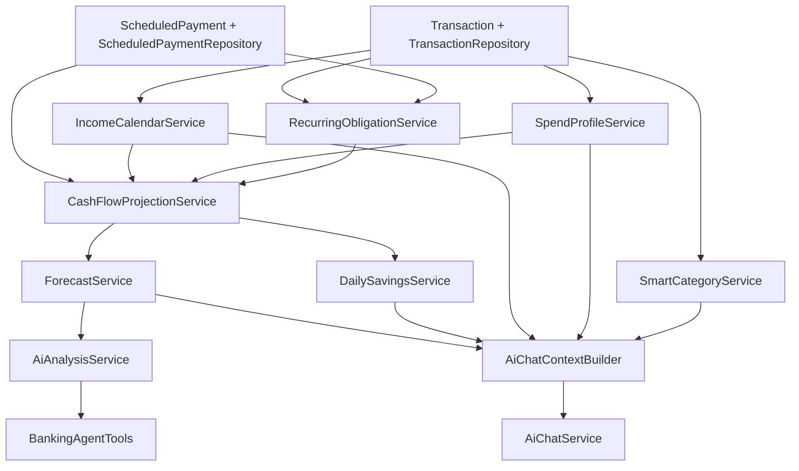

# Текущие финансовые алгоритмы

Документ фиксирует текущее состояние финансовых алгоритмов проекта по коду ветки `codex/extract-m-bank-dashboard`.

В документе описаны:

- бэкенд-алгоритмы, которые считают деньги, прогнозы и рекомендации;
- AI-слой, который объясняет и исполняет действия;
- фронтенд-слои, которые используют эти результаты и дополняют их локальными вычислениями;
- стартовый demo-сценарий, задаваемый сидированием данных.

## Навигация

- разделы 1-6: базовые сущности, demo-данные и прикладные сервисы;
- разделы 7-13: прогноз доходов, расходов, денежного потока и Safe-to-Save;
- разделы 14-17: AI-анализ, контекст и инструментальные действия;
- разделы 18-21: фронтенд, API-карта и итоговое состояние модели.

## 1. Общая карта зависимостей



## 2. Базовые сущности и правила, на которых все держится

### 2.1 `Transaction`

Файл: [Transaction.java](C:/Users/user/IdeaProjects/HackathonBank/src/main/java/com/example/hackathonbank/model/Transaction.java)

`Transaction` — главный источник финансовой истории. Почти все алгоритмы строятся на completed-транзакциях по `AccountType.MAIN`.

При создании записи модель сразу вычисляет производные признаки:

- `normalizedCounterparty`
- `incomeType`
- `essentiality`

Эти признаки потом повторно используются в:

- [IncomeCalendarService.java](C:/Users/user/IdeaProjects/HackathonBank/src/main/java/com/example/hackathonbank/service/IncomeCalendarService.java)
- [SpendProfileService.java](C:/Users/user/IdeaProjects/HackathonBank/src/main/java/com/example/hackathonbank/service/SpendProfileService.java)
- [RecurringObligationService.java](C:/Users/user/IdeaProjects/HackathonBank/src/main/java/com/example/hackathonbank/service/RecurringObligationService.java)

### 2.2 `TransactionStatus`

Файл: [TransactionStatus.java](C:/Users/user/IdeaProjects/HackathonBank/src/main/java/com/example/hackathonbank/model/TransactionStatus.java)

Критичное разделение:

- `COMPLETED` — совершившаяся операция, учитывается в истории, профилях и аналитике;
- `SCHEDULED` / `POSTPONED` — будущая операция, не является реальным движением денег, но учитывается в прогнозах и AI-рекомендациях.

### 2.3 `AccountType`

Файл: [AccountType.java](C:/Users/user/IdeaProjects/HackathonBank/src/main/java/com/example/hackathonbank/model/AccountType.java)

Практически все алгоритмы Safe-to-Save и forecast строятся вокруг:

- `MAIN` — ликвидный счет, от которого считается дефицит и автосбережение;
- `SAVINGS` — накопительный счет, который используется как подушка и потенциальный источник покрытия кассового разрыва.

## 3. Источник demo-сценария и стартовой финансовой картины

Файл: [DataSeederConfig.java](C:/Users/user/IdeaProjects/HackathonBank/src/main/java/com/example/hackathonbank/config/DataSeederConfig.java)

### 3.1 Целевые константы

- `MAIN_START_CAPITAL = 20000.00`
- `TARGET_MAIN_BALANCE = 15000.00`
- `SAVINGS_BALANCE = 50000.00`

### 3.2 Как формируется история

Сидирование строит несколько слоев истории:

1. Повторяющиеся доходы:
   - зарплата;
   - подработка;
   - возвраты;
   - cashback;
   - перевод от семьи.
2. Повторяющиеся обязательные расходы:
   - аренда;
   - коммунальные;
   - интернет;
   - связь.
3. Lifestyle-расходы на последние 84 дня:
   - еда;
   - транспорт;
   - QR-платежи;
   - аптека;
   - переводы;
   - кофейни;
   - рестораны, маркетплейсы и развлечения по выходным.
4. Набор свежих операций для наглядной ленты.
5. Финальный слой `settleTargetBalanceWithRealisticEntries(...)`, который доводит completed history до ровно `TARGET_MAIN_BALANCE`.

### 3.3 Финальная математика баланса

После генерации completed history применяется формула:

```text
mainBalance = MAIN_START_CAPITAL + sum(completed transaction amounts)
```

После этого в `MAIN` сохраняется баланс, который математически совпадает с историей completed операций.

### 3.4 Будущие платежи

Сидируются три `ScheduledPayment`:

- аренда;
- коммунальные;
- интернет.

Они не входят в completed balance, но входят в прогнозы и AI-анализ.

## 4. `TransactionService`: правила записи истории и обновления баланса

Файл: [TransactionService.java](C:/Users/user/IdeaProjects/HackathonBank/src/main/java/com/example/hackathonbank/service/TransactionService.java)

### 4.1 Что делает

- Возвращает пользователю только `COMPLETED` историю.
- Создает новые completed транзакции.
- Сразу синхронно меняет баланс выбранного счета.
- Привязывает одну или несколько expense-транзакций к Smart List категории.

### 4.2 Нормализация суммы

При создании:

- `INCOME` -> сумма приводится к положительной;
- все остальные типы -> сумма приводится к отрицательной.

```text
INCOME => +abs(amount)
OTHER  => -abs(amount)
```

### 4.3 Обновление баланса

После сохранения completed transaction:

```text
account.balance = account.balance + normalizedAmount
```

Это означает, что transaction history и баланс счета всегда должны быть согласованы, если запись создана через сервис.

### 4.4 Привязка к Smart List

В Smart List можно привязать только:

- `COMPLETED`
- отрицательные транзакции

Массовая привязка работает тем же правилом, через `assignTransactionsToSmartCategory(...)`.

## 5. `SmartCategoryService`: как считается состояние Smart List

Файл: [SmartCategoryService.java](C:/Users/user/IdeaProjects/HackathonBank/src/main/java/com/example/hackathonbank/service/SmartCategoryService.java)

### 5.1 Что хранит Smart List

Для категории важны:

- `name`
- `plannedMonthly`
- `favorite`

### 5.2 Как считается остаток по категории

Остаток считается не на UI, а на backend:

1. Берется окно текущего месяца:
   - от первого числа месяца `00:00`
   - до текущей effective date `23:59:59`
2. Через [TransactionRepository.java](C:/Users/user/IdeaProjects/HackathonBank/src/main/java/com/example/hackathonbank/repository/TransactionRepository.java) вызывается агрегация `sumSpentBySmartCategory(...)`.
3. Для каждой категории:

```text
remaining = plannedMonthly - spent
```

### 5.3 Удаление категории

При удалении:

1. Находятся все связанные транзакции пользователя.
2. У этих транзакций `smartCategory` сбрасывается в `null`.
3. Категория удаляется.

Это важно для уведомлений и повторной привязки расходов.

## 6. `ScheduledPaymentService` и логика будущих платежей

Файл: [ScheduledPaymentService.java](C:/Users/user/IdeaProjects/HackathonBank/src/main/java/com/example/hackathonbank/service/ScheduledPaymentService.java)

### 6.1 Что делает

- создает будущий платеж;
- может перенести его;
- создает shadow transaction со статусом `SCHEDULED`.

### 6.2 Гибкость платежа

Каждый платеж имеет флаг `flexible`.

Источник флага:

- либо явное значение из request;
- либо эвристика `ScheduledPayment.classifyFlexibility(title, category)`.

Этот флаг используется в:

- [AiAnalysisService.java](C:/Users/user/IdeaProjects/HackathonBank/src/main/java/com/example/hackathonbank/ai/AiAnalysisService.java)
- карточках upcoming payments;
- сценариях переноса для покрытия дефицита.

### 6.3 Перенос платежа

При переносе:

- меняется `dueDate`;
- статус меняется на `POSTPONED`;
- связанная scheduled transaction сдвигается на ту же дату.

## 7. `IncomeCalendarService`: алгоритм прогноза следующего дохода

Файл: [IncomeCalendarService.java](C:/Users/user/IdeaProjects/HackathonBank/src/main/java/com/example/hackathonbank/service/IncomeCalendarService.java)

Это сервис, который пытается понять, когда и сколько денег пользователь, вероятно, получит дальше.

### 7.1 Историческое окно

Используется окно:

- `LOOKBACK_DAYS = 120`

Берутся completed positive transactions по `MAIN`, кроме `TRANSFER`.

### 7.2 Классификация дохода

Доходы классифицируются в `IncomeType`:

- `SALARY`
- `FREELANCE`
- `TOPUP`
- `REFUND`
- `OTHER`

Приоритет источников:

1. если у `Transaction` уже задан `incomeType`, он используется;
2. иначе срабатывает keyword/amount heuristic по `title + category + counterparty`.

Примеры эвристики:

- `возврат`, `refund`, `cashback` -> `REFUND`
- `пополнение`, `top up`, `deposit` -> `TOPUP`
- `зарплат`, `salary`, `оклад`, `аванс` -> `SALARY`
- если сумма `>= 5000` и ничего лучше не подошло -> `FREELANCE`
- иначе -> `OTHER`

### 7.3 Кластеризация

Доходы группируются по ключу:

- `IncomeType`
- `normalizedCounterparty`
- `amount band`
- `day-of-month` с допуском

Константы:

- `DAY_TOLERANCE = 2`
- `AMOUNT_BAND_SIZE = 10000.00`

То есть сервис пытается найти повторяющиеся поступления одного типа, от одного контрагента, со схожей суммой, в похожий день месяца.

### 7.4 Что считается по каждому кластеру

Для кластера вычисляется:

- `averageAmount`
- `expectedDayOfMonth`
- `occurrences`
- `distinctMonths`
- `confidencePercent`

### 7.5 Как считается confidence

Схема confidence:

```text
base = min(95, occurrences * 28)
base += min(15, distinctMonths * 4)
salary bonus = +8

dayPenalty      = max(0, maxDay - minDay - DAY_TOLERANCE) * 4
amountPenalty   = min(25, coefficientOfVariation * 30)
cadencePenalty  = штраф за пропущенные месяцы

confidence = clamp(base - dayPenalty - amountPenalty - cadencePenalty, 0..100)
```

### 7.6 Выбор основного кластера

Сначала сервис пытается выбрать recurring cluster с `confidence >= 50`.

Приоритет:

1. тип (`SALARY` выше `FREELANCE`, выше `TOPUP`, выше `REFUND/OTHER`)
2. ближайшая следующая дата
3. confidence

Если таких кластеров нет, выбирается наиболее уверенный кластер вообще.

### 7.7 Что возвращает сервис

Сервис возвращает `IncomeCalendar`, внутри которого есть:

- список `IncomeCluster`
- `NextIncomeForecast`

`NextIncomeForecast` содержит:

- `expectedDate`
- `dateFrom`
- `dateTo`
- `expectedAmount`
- `incomeType`
- `confidencePercent`

### 7.8 Генерация будущих income events

Метод `projectedIncomeEvents(...)` строит события дохода на горизонт:

- берет кластеры с confidence не ниже заданного порога;
- для каждого кластера генерирует повторяющиеся expected dates;
- для консервативной даты использует `rangeEnd`.

Именно эти income events потом попадают в projection engine.

## 8. `SpendProfileService`: профиль повседневных расходов

Файл: [SpendProfileService.java](C:/Users/user/IdeaProjects/HackathonBank/src/main/java/com/example/hackathonbank/service/SpendProfileService.java)

Этот сервис отвечает за оценку обычного бытового burn rate.

### 8.1 Историческое окно

- `LOOKBACK_DAYS = 30`

Берутся completed negative transactions по `MAIN`.

### 8.2 Исключение recurring расходов

Сервис может получить `excludedRecurringKeys`.

Транзакции с `normalizedCounterparty` из этого набора исключаются, чтобы не учитывать подтвержденные recurring obligations второй раз в everyday spend.

### 8.3 Деление на essential и discretionary

Источники классификации:

1. если у транзакции уже стоит `essentiality`, оно используется;
2. если нет, включается keyword heuristic по `title + category`.

`ESSENTIAL` включают, например:

- еду;
- супермаркеты;
- аптеки;
- транспорт;
- бензин;
- аренду;
- коммунальные;
- связь и интернет;
- подписки.

Все остальное уходит в `DISCRETIONARY`.

### 8.4 Базовые дневные средние

Считаются отдельно:

```text
dailyEssentialSpend = totalEssential / 30
dailyDiscretionarySpend = totalDiscretionary / 30
```

### 8.5 Множители по дням недели

Сервис считает, как распределяются траты по дням недели:

1. для каждого weekday считает total spent;
2. делит его на количество таких дней в окне;
3. получает среднее на понедельник, вторник и так далее;
4. нормализует это относительно общей средней за 7 дней.

В результате формируются:

- `essentialWeekdayMultipliers`
- `discretionaryWeekdayMultipliers`

### 8.6 Волатильность

Волатильность считается как коэффициент вариации:

```text
dailySpend[date] = sum(expenses on date)
mean = average(dailySpend)
variance = average((dailySpend - mean)^2)
stdDev = sqrt(variance)
volatility = stdDev / mean
```

Это число затем используется в Safe-to-Save как часть защитного буфера.

### 8.7 Что возвращает сервис

`SpendProfile` содержит:

- `dailyEssentialSpend`
- `dailyDiscretionarySpend`
- weekday multipliers
- `volatility`
- `excludedRecurringKeys`

Также он умеет возвращать:

- `projectedEssentialSpend(dayOfWeek)`
- `projectedDiscretionarySpend(dayOfWeek)`
- `projectedSpend(dayOfWeek)`

## 9. `RecurringObligationService`: поиск обязательств, которых нет в ScheduledPayment

Файл: [RecurringObligationService.java](C:/Users/user/IdeaProjects/HackathonBank/src/main/java/com/example/hackathonbank/service/RecurringObligationService.java)

Этот сервис пытается предсказать recurring bills, которые пользователь еще не оформил явно как `ScheduledPayment`.

### 9.1 Историческое окно и фильтры

- `LOOKBACK_DAYS = 120`
- только completed negative transactions по `MAIN`
- исключаются:
  - `TRANSFER`
  - транзакции, уже связанные с `ScheduledPayment`

### 9.2 Как строится ключ группы

Группа строится по:

- `normalizedCounterparty`
- нормализованной категории
- `SpendEssentiality`

### 9.3 Требования к recurring cluster

Минимум:

- `MIN_OCCURRENCES = 2`
- `distinctMonths >= 2`

### 9.4 Метрики кластера

Для кластера считаются:

- `expectedAmount`
- `weightedAmount`
- `expectedDayOfMonth`
- `confidencePercent`
- `occurrences`
- `distinctMonths`

### 9.5 Confidence recurring obligations

Схема похожа на income clustering:

```text
base = min(90, occurrences * 22)
essential bonus = +8 for ESSENTIAL
dayPenalty = max(0, maxDay - minDay - DAY_TOLERANCE) * 4
amountPenalty = min(25, coefficientOfVariation * 35)
confidence = clamp(base + essentialBonus - dayPenalty - amountPenalty, 0..100)
```

### 9.6 Взвешенная сумма

Чтобы не считать inferred obligation на 100% при низкой уверенности, применяется confidence weighting:

- `>= 80%` -> `1.00`
- `>= 65%` -> `0.80`
- ниже -> `0.60`

```text
weightedAmount = expectedAmount * confidenceFactor
```

### 9.7 Исключение дублей confirmed scheduled payments

Сервис сначала строит `confirmedKeys` из pending `ScheduledPayment`.

Если inferred recurring obligation совпадает с уже подтвержденным scheduled payment, он выкидывается, чтобы один и тот же bill не учитывался дважды.

### 9.8 Что возвращает сервис

`RecurringObligationForecast`:

- `clusters`
- `events`
- `recurringKeys`

`recurringKeys` потом передаются в `SpendProfileService`, чтобы исключить эти траты из lifestyle spend.

## 10. `CashFlowProjectionService`: ядро прогноза денежного потока

Файл: [CashFlowProjectionService.java](C:/Users/user/IdeaProjects/HackathonBank/src/main/java/com/example/hackathonbank/service/CashFlowProjectionService.java)

Это главный движок, который строит прогноз по дням.

### 10.1 Что он использует

- текущий `MAIN` и `SAVINGS` balances;
- pending `ScheduledPayment` только по `MAIN`;
- inferred recurring obligations;
- daily spend profile;
- projected income events.

### 10.2 Какие confirmed платежи попадают в прогноз

Берутся только те `ScheduledPayment`, которые:

- принадлежат `MAIN`;
- имеют статус `SCHEDULED` или `POSTPONED`;
- не раньше `currentDate`;
- не позже `horizonEnd`.

### 10.3 Основные подготовительные шаги

Перед дневным проходом сервис строит:

- `RecurringObligationForecast`
- `SpendProfile`
- `IncomeCalendar`
- `incomeEvents`

Порог доходов для projection:

- `minConfidence = 50`

### 10.4 Дневная формула баланса

Старт:

```text
startingMainBalance = mainAccount.balance - immediateTransferAmount
```

Для каждого дня после текущего:

```text
runningBalance =
    previousBalance
    - essentialSpend
    - discretionarySpend
    - confirmedOutflow
    - inferredOutflow
    + projectedIncome
```

### 10.5 Что дополнительно считает projection

Во время прохода по дням обновляются:

- `minimumBalance`
- `firstNegativeDate`

Также считаются итоговые суммы горизонта:

- `confirmedOutflowsTotal`
- `inferredOutflowsTotal`
- `livingSpendTotal`

### 10.6 Что возвращает projection

`CashFlowProjection` содержит:

- список `ProjectedCashFlowDay`
- `minimumBalance`
- `firstNegativeDate`
- `incomeCalendar`
- `incomeEvents`
- `spendProfile`
- `confirmedPayments`
- `recurringForecast`
- totals по расходам

Это главная source of truth для forecast и Safe-to-Save.

## 11. `ForecastService`: адаптация projection в dashboard

Файл: [ForecastService.java](C:/Users/user/IdeaProjects/HackathonBank/src/main/java/com/example/hackathonbank/service/ForecastService.java)

`ForecastService` ничего нового не предсказывает. Он адаптирует projection engine под UI.

### 11.1 Что делает

1. Получает `currentDate` из `UserSettingsService`.
2. Вызывает `CashFlowProjectionService.buildProjection(userId, today, horizonDays)`.
3. Преобразует каждый `ProjectedCashFlowDay` в `DashboardPoint`.
4. Преобразует pending payments в `ScheduledPaymentSnapshot`.

### 11.2 Что попадает в `DashboardPoint`

Каждая точка содержит:

- `dayOffset`
- `isoDate`
- `label`
- `balance`
- `projectedIncome`
- `totalOutflow`

Именно этот набор потом рисуется на графике во вкладке анализа и в детальной аналитике.

## 12. `DailySavingsService`: текущий алгоритм Safe-to-Save

Файл: [DailySavingsService.java](C:/Users/user/IdeaProjects/HackathonBank/src/main/java/com/example/hackathonbank/service/DailySavingsService.java)

Это текущая реализация Safe-to-Save и ежедневного автосбережения.

### 12.1 Константы

- `MINIMUM_MAIN_BALANCE = 1000.00`
- `OVERDRAFT_GUARD = 100.00`
- `SAVE_RATIO = 0.05`
- `GUARDED_RESERVE = 100.00`
- `DISCRETIONARY_BUFFER_FACTOR = 0.85`
- `BASE_BUFFER_MULTIPLIER = 1.10`

### 12.2 Блокировка на входе

Если у пользователя на `MAIN` меньше `1000.00`, Safe-to-Save блокируется сразу.

### 12.3 Горизонт расчета

Горизонт определяется через `IncomeCalendarService`:

- строится `IncomeCalendar`;
- выбирается окно до следующего ожидаемого дохода;
- `incomeHorizonEnd` берется как `rangeEnd`, если она позже текущей даты, иначе `nextExpectedDate`.

### 12.4 Что берет из projection

`DailySavingsService` использует projection как источник:

- `confirmedOutflowsTotal`
- `inferredOutflowsTotal`
- essential/discretionary spend по дням
- `minimumBalance`

### 12.5 Формирование life buffer

Сначала считаются суммы по горизонту:

```text
essentialBuffer      = sum(day.essentialSpend)
discretionaryBuffer  = sum(day.discretionarySpend)
behaviorAdjustedSpend = essentialBuffer + discretionaryBuffer * 0.85
```

Затем считается множитель:

```text
bufferMultiplier =
    1.10
    + volatilityReserve(projection)
    + incomeConfidenceReserve(incomeCalendar)
```

Где:

- `volatilityReserve = min(spendProfile.volatility * 0.35, 0.35)`
- `incomeConfidenceReserve`:
  - `0.00`, если confidence `>= 80`
  - `0.10`, если confidence `>= 60`
  - `0.20`, иначе

Итог:

```text
lifeBuffer = behaviorAdjustedSpend * bufferMultiplier
```

### 12.6 Обязательные платежи

Safe-to-Save считает обязательства как сумму:

```text
requiredPayments = confirmedOutflowsTotal + inferredOutflowsTotal
```

### 12.7 Safe balance

Текущая формула:

```text
safeBalance =
    currentMainBalance
    - requiredPayments
    - lifeBuffer
    - 100.00
```

Последние `100.00` — это guarded reserve.

### 12.8 Рекомендуемая сумма перевода

Если `safeBalance > 0`:

```text
suggestedAmount = safeBalance * 0.05
```

Иначе:

```text
suggestedAmount = 0
```

### 12.9 Overdraft Guard

Если предварительная рекомендованная сумма больше нуля, сервис делает второй проход:

1. строит projection после гипотетического перевода;
2. проверяет `minimumBalance` после перевода;
3. если он ниже `100.00`, перевод блокируется.

Итог:

```text
if projectedMinimumBalanceAfterTransfer < 100:
    suggestedAmount = 0
    overdraftGuardTriggered = true
```

### 12.10 Что возвращает preview

API-контракт лежит в [DailySavingsPreviewResponse.java](C:/Users/user/IdeaProjects/HackathonBank/src/main/java/com/example/hackathonbank/controller/dto/DailySavingsPreviewResponse.java)

Ключевые поля:

- `enabled`
- `suggestedAmount`
- `safeBalance`
- `currentBalance`
- `requiredPayments`
- `lifeBuffer`
- `nextIncomeDate`
- `daysToNextIncome`
- `status`
- `guardReserve`
- `projectedMinimumBalanceAfterTransfer`
- `overdraftGuardTriggered`
- `incomeConfidence`
- `expectedIncomeAmount`
- `expectedIncomeType`

### 12.11 Автоматическое ежедневное выполнение

Файл: [DailySavingsScheduler.java](C:/Users/user/IdeaProjects/HackathonBank/src/main/java/com/example/hackathonbank/service/DailySavingsScheduler.java)

Планировщик:

1. выбирает пользователей с `autoDailySaveEnabled = true`;
2. запускает `processDailyAutoSave(...)`;
3. если `suggestedAmount > 0`, вызывает `TransferService.autoSaveToSavings(...)`;
4. после перевода формирует персонализированное уведомление.

### 12.12 Уведомление после автоперевода

`DailySavingsService` берет completed transactions за последние 3 дня и:

- если live AI доступен — просит модель собрать короткое уведомление;
- иначе строит deterministic fallback по самой крупной recent category.

## 13. `AiAnalysisService`: рекомендации по кассовому разрыву

Файл: [AiAnalysisService.java](C:/Users/user/IdeaProjects/HackathonBank/src/main/java/com/example/hackathonbank/ai/AiAnalysisService.java)

Этот сервис берет dashboard forecast и превращает его в пользовательский совет.

### 13.1 Базовый вход

Он использует:

- `ForecastService.buildDashboard(offsetDays)`
- completed transactions
- pending payments
- main/savings balances
- `TransactionEnrichmentService`

### 13.2 Если дефицита нет

Если `minimumProjectedBalance >= 0`:

- возвращается спокойное reasoning;
- alert не показывается;
- suggestions пустые.

### 13.3 Если дефицит есть

Если `minimumProjectedBalance < 0`:

1. считается `deficit = abs(minimumProjectedBalance)`;
2. ищется:
   - первая дата отрицательного баланса;
   - дата минимального баланса;
3. собираются платежи, внесшие вклад в дефицит;
4. строится timeline message.

### 13.4 Какие советы может предложить сервис

1. `CLOSE_DEPOSIT`
   - перевести деньги из накопительного счета в `MAIN`.
2. `POSTPONE`
   - перенести один гибкий платеж.
3. `POSTPONE_GROUP`
   - перенести набор гибких платежей.
4. `CLOSE_DEPOSIT_AND_POSTPONE`
   - комбинировать подушку и перенос.

### 13.5 Как выбираются гибкие платежи

Сервис собирает только `flexible` pending payments в горизонте.

#### Один платеж

Сначала пытается найти один платеж, который полностью перекрывает дефицит.

#### Группа платежей

Если платежей `<= 15`, используется полный перебор подмножеств:

- минимальное число платежей;
- при равенстве — минимальная общая сумма.

Если платежей больше:

- fallback на жадный greedy coverage.

### 13.6 Дата переноса

Рекомендуемая дата переноса строится через `IncomeCalendarService`:

- если следующий доход достаточно уверенный (`confidence >= 50`), переносится к окну income calendar;
- иначе fallback `+7 дней`.

## 14. `TransactionEnrichmentService`: объясняющий слой для AI-анализа

Файл: [TransactionEnrichmentService.java](C:/Users/user/IdeaProjects/HackathonBank/src/main/java/com/example/hackathonbank/ai/TransactionEnrichmentService.java)

Сервис делит transactions и pending payments на 3 смысловые группы:

- `Базовые потребности`
- `Регулярные/Обязательные`
- `Динамические`

### 14.1 Live mode

Если live AI включен:

- сервис отправляет completed transactions и scheduled payments модели;
- ожидает строго JSON с `groups`, `riskLevel`, `reasoning`.

### 14.2 Deterministic fallback

Если live enrichment отключен или сломан:

- используется keyword-based классификация по `title + category`;
- для каждой группы считается `total`;
- `riskLevel` зависит от `minimumProjectedBalance`;
- строится fallback reasoning.

Это вспомогательный алгоритм для объяснения, а не source of truth для денег.

## 15. `AiChatContextBuilder`: полный финансовый контекст для AI-чата

Файл: [AiChatContextBuilder.java](C:/Users/user/IdeaProjects/HackathonBank/src/main/java/com/example/hackathonbank/service/AiChatContextBuilder.java)

Этот сервис строит JSON-слепок финансового состояния пользователя.

### 15.1 Что входит в контекст

- пользователь;
- accounts;
- balances;
- summary last 90 days;
- transactions за 3 месяца;
- scheduled payments;
- daily Safe-to-Save preview;
- smart categories;
- derived features.

### 15.2 Производные признаки

Туда входят:

- `incomeCalendar`
- `nextIncomeDate`
- `incomeConfidence`
- `incomeWindowStart`
- `incomeWindowEnd`
- `expectedIncomeAmount`
- `expectedIncomeType`
- `burnRate`
- `burnRateEssential`
- `burnRateDiscretionary`
- `burnRateVolatility`
- `weekdaySpendProfile`
- `daysToNegativeBalance`
- `freeBalance`
- `recurringMerchants`

### 15.3 Как считается `freeBalance`

Сейчас:

```text
freeBalance = currentBalance - requiredPayments - guardReserve
```

Где `requiredPayments` и `guardReserve` берутся из daily Safe-to-Save preview.

## 16. `AiChatService`: диалог и инструментальные действия

Файл: [AiChatService.java](C:/Users/user/IdeaProjects/HackathonBank/src/main/java/com/example/hackathonbank/service/AiChatService.java)

### 16.1 Как строится ответ

1. Проверяется, что `newMessage` не пустой.
2. Нормализуется client-side history, максимум 40 сообщений.
3. Собирается system prompt с полным JSON-контекстом из `AiChatContextBuilder`.
4. В `ChatClient` отправляется:
   - system prompt;
   - history;
   - новое пользовательское сообщение;
   - `BankingAgentTools`.
5. Ответ ассистента сохраняется в `ChatMessageRepository`.

### 16.2 Сохраняемая история

Сервис хранит серверную историю в БД:

- `USER`
- `ASSISTANT`

И умеет отдельно вернуть историю из репозитория.

### 16.3 Отложенные действия

Если AI инициировал удаление Smart List категории:

- само удаление не исполняется сразу;
- создается токен отложенного действия;
- фронтенд позже подтверждает или отменяет действие;
- затем `resolveAction(...)` либо удаляет категорию, либо возвращает отмену.

## 17. `BankingAgentTools`: доступные действия AI-агента

Файл: [BankingAgentTools.java](C:/Users/user/IdeaProjects/HackathonBank/src/main/java/com/example/hackathonbank/ai/BankingAgentTools.java)

### 17.1 Инструменты

- `autoTransferFromSavings(amount)`
- `postponePayment(paymentId)`
- `createSmartCategory(name, limit)`
- `updateSmartCategoryLimit(categoryId, newLimit)`
- `deleteSmartCategory(categoryId)`

### 17.2 Важное ограничение

Удаление Smart List работает через ожидание подтверждения:

- инструмент не удаляет категорию мгновенно;
- он регистрирует токен;
- фронтенд показывает подтверждение;
- только потом бэкенд исполняет удаление.

## 18. Фронтенд: как эти алгоритмы используются в UI

### 18.1 Общая оркестрация

Файл: [app_shell.dart](C:/Users/user/IdeaProjects/HackathonBank/mobile/lib/screens/app_shell.dart)

`AppShell`:

- держит вкладки приложения;
- раздает единый `refreshSignal`;
- после изменения данных триггерит обновление:
  - `HomeScreen`
  - `AiDashboardScreen`
  - `TransfersScreen`

### 18.2 Вкладка `Analysis`

Файл: [ai_dashboard_screen.dart](C:/Users/user/IdeaProjects/HackathonBank/mobile/packages/m_bank_dashboard/lib/src/screens/ai_dashboard_screen.dart)

#### Что грузится

Основные данные:

- dashboard
- transactions
- accounts
- smart categories
- daily safe-to-save
- smart list setting
- admin mode setting
- auto-daily-save setting
- effective date

Отдельно, асинхронно после первого рендера:

- `analyzeCashFlow`

#### Почему это важно

Это значит, что тяжелый AI-анализ не блокирует вход на вкладку `Анализ`. Сначала рисуется основа экрана, затем догружается advisory-слой.

### 18.3 `_DailySafeToSaveCard`

Файл: [ai_dashboard_widgets.dart](C:/Users/user/IdeaProjects/HackathonBank/mobile/packages/m_bank_dashboard/lib/src/screens/ai_dashboard_widgets.dart)

Карточка показывает данные строго из backend-preview:

- текущий баланс;
- платежи до дохода;
- буфер на жизнь;
- safe balance;
- следующую дату дохода;
- состояние автонакопления.

Клиент ничего не пересчитывает.

Подпись `safeBalance` динамическая:

- `Свободный остаток`, если значение положительное;
- `Ожидаемый дефицит`, если отрицательное.

### 18.4 Месячная сводная карточка

Файл: [ai_dashboard_screen.dart](C:/Users/user/IdeaProjects/HackathonBank/mobile/packages/m_bank_dashboard/lib/src/screens/ai_dashboard_screen.dart)

Локальный клиентский расчет:

- берутся только `COMPLETED` transactions;
- строится сводка за текущий месяц относительно effective date;
- считаются:
  - income
  - expenses
  - QR
  - transfers
  - shopping
  - restaurants

Это чисто визуальная аналитика, а не источник истины на backend.

### 18.5 Экран `Detailed Analytics`

Файл: [detailed_analytics_screen.dart](C:/Users/user/IdeaProjects/HackathonBank/mobile/packages/m_bank_dashboard/lib/src/screens/detailed_analytics_screen.dart)

Экран принимает:

- `transactions`
- `backendForecastPoints`

Логика:

- если серверные forecast points есть, используются они;
- если нет, включается fallback-клиентский прогноз.

Локально строятся:

- сгруппированные столбцы по доходам и расходам за месяцы;
- net trend за 90 дней;
- круговая диаграмма текущего месяца;
- график прогноза.

Для локальной аналитики фильтруются только `COMPLETED` транзакции.

### 18.6 Smart List во время оплаты

Файлы:

- [transfers_screen.dart](C:/Users/user/IdeaProjects/HackathonBank/mobile/lib/screens/transfers_screen.dart)
- [transaction_capture_sheet.dart](C:/Users/user/IdeaProjects/HackathonBank/mobile/packages/m_bank_dashboard/lib/src/widgets/transaction_capture_sheet.dart)

UI показывает остаток категории прямо в выборе:

- справа от имени категории — `remaining`;
- ниже выбранной категории — `Остаток по лимиту`;
- если остаток отрицательный, число красится в coral.

Сами цифры не считаются на клиенте. Они приходят из `SmartCategoryResponse.remaining`.

### 18.7 `Notifications` -> Smart List

Файл: [notifications_screen.dart](C:/Users/user/IdeaProjects/HackathonBank/mobile/lib/screens/notifications_screen.dart)

Экран поддерживает:

- single-assign транзакции в Smart List;
- multi-select по long press;
- bulk categorize выбранных расходов через bottom sheet категорий.

Алгоритм UI:

1. пользователь выбирает одну или несколько transaction-driven notifications;
2. открывается выбор существующей Smart List категории;
3. фронтенд отправляет `transactionIds + categoryId` на backend;
4. после успешной привязки вызывается `onSmartListChanged`.

### 18.8 UI AI-чата

Файл: [ai_chat_screen.dart](C:/Users/user/IdeaProjects/HackathonBank/mobile/lib/screens/ai_chat_screen.dart)

Клиентская логика минимальна:

- отправляет history + новое сообщение;
- показывает typing bubble;
- показывает confirm UI для pending AI actions.

Финансовый контекст клиент не считает. Он полностью приходит через backend system prompt.

## 19. API-карта алгоритмов

### 19.1 Анализ и прогноз

Файл: [AiController.java](C:/Users/user/IdeaProjects/HackathonBank/src/main/java/com/example/hackathonbank/controller/AiController.java)

- `GET /api/v1/ai/dashboard` -> [ForecastService.java](C:/Users/user/IdeaProjects/HackathonBank/src/main/java/com/example/hackathonbank/service/ForecastService.java)
- `POST /api/v1/ai/analyze` -> [AiAnalysisService.java](C:/Users/user/IdeaProjects/HackathonBank/src/main/java/com/example/hackathonbank/ai/AiAnalysisService.java)
- `POST /api/v1/ai/execute` -> action execution
- `GET /api/v1/ai/daily-safe-to-save` -> [DailySavingsService.java](C:/Users/user/IdeaProjects/HackathonBank/src/main/java/com/example/hackathonbank/service/DailySavingsService.java)
- `GET /api/v1/ai/save-suggestion` -> lightweight wrapper around Safe-to-Save preview
- `GET/POST /api/v1/ai/auto-daily-save` -> user toggle

### 19.2 Демо/симуляция

Файл: [DemoController.java](C:/Users/user/IdeaProjects/HackathonBank/src/main/java/com/example/hackathonbank/controller/DemoController.java)

- `POST /api/v1/demo/simulate-day`

Сдвигает effective date на один день вперед и сразу запускает Safe-to-Save.

### 19.3 Smart List

Файл: [SmartCategoryController.java](C:/Users/user/IdeaProjects/HackathonBank/src/main/java/com/example/hackathonbank/controller/SmartCategoryController.java)

CRUD и favorite-операции для категорий.

### 19.4 Transactions

Файл: [TransactionController.java](C:/Users/user/IdeaProjects/HackathonBank/src/main/java/com/example/hackathonbank/controller/TransactionController.java)

Критичны для:

- истории;
- создания расхода/дохода;
- bulk categorization в Smart List.

### 19.5 AI-чат

Файлы:

- [AiChatController.java](C:/Users/user/IdeaProjects/HackathonBank/src/main/java/com/example/hackathonbank/controller/AiChatController.java)
- [AiChatService.java](C:/Users/user/IdeaProjects/HackathonBank/src/main/java/com/example/hackathonbank/service/AiChatService.java)

Контракт:

- история;
- сообщение;
- подтверждение AI-действия.

## 20. Какие сервисы являются источником истины

### Финансовая математика

- [TransactionService.java](C:/Users/user/IdeaProjects/HackathonBank/src/main/java/com/example/hackathonbank/service/TransactionService.java)
- [CashFlowProjectionService.java](C:/Users/user/IdeaProjects/HackathonBank/src/main/java/com/example/hackathonbank/service/CashFlowProjectionService.java)
- [DailySavingsService.java](C:/Users/user/IdeaProjects/HackathonBank/src/main/java/com/example/hackathonbank/service/DailySavingsService.java)
- [SmartCategoryService.java](C:/Users/user/IdeaProjects/HackathonBank/src/main/java/com/example/hackathonbank/service/SmartCategoryService.java)

### Объяснение и рекомендации

- [AiAnalysisService.java](C:/Users/user/IdeaProjects/HackathonBank/src/main/java/com/example/hackathonbank/ai/AiAnalysisService.java)
- [TransactionEnrichmentService.java](C:/Users/user/IdeaProjects/HackathonBank/src/main/java/com/example/hackathonbank/ai/TransactionEnrichmentService.java)
- [AiChatContextBuilder.java](C:/Users/user/IdeaProjects/HackathonBank/src/main/java/com/example/hackathonbank/service/AiChatContextBuilder.java)
- [AiChatService.java](C:/Users/user/IdeaProjects/HackathonBank/src/main/java/com/example/hackathonbank/service/AiChatService.java)

### UI-представление

- [ai_dashboard_screen.dart](C:/Users/user/IdeaProjects/HackathonBank/mobile/packages/m_bank_dashboard/lib/src/screens/ai_dashboard_screen.dart)
- [ai_dashboard_widgets.dart](C:/Users/user/IdeaProjects/HackathonBank/mobile/packages/m_bank_dashboard/lib/src/screens/ai_dashboard_widgets.dart)
- [detailed_analytics_screen.dart](C:/Users/user/IdeaProjects/HackathonBank/mobile/packages/m_bank_dashboard/lib/src/screens/detailed_analytics_screen.dart)
- [transfers_screen.dart](C:/Users/user/IdeaProjects/HackathonBank/mobile/lib/screens/transfers_screen.dart)
- [notifications_screen.dart](C:/Users/user/IdeaProjects/HackathonBank/mobile/lib/screens/notifications_screen.dart)
- [ai_chat_screen.dart](C:/Users/user/IdeaProjects/HackathonBank/mobile/lib/screens/ai_chat_screen.dart)

## 21. Текущее состояние модели по смыслу

### Что уже достаточно зрелое

- детерминированный projection engine вместо случайной симуляции;
- разделение `MAIN` и `SAVINGS`;
- confirmed vs inferred obligations;
- daily Safe-to-Save preview с Overdraft Guard;
- Smart List remaining, считающийся на backend;
- AI-chat с полным финансовым JSON-контекстом и инструментами.

### Что остается эвристическим

- классификация income type;
- keyword-based fallback для essential/discretionary;
- keyword-based fallback для enrichment;
- эвристика гибкости платежа;
- fallback forecast на клиенте, если backend points недоступны.

Именно поэтому source of truth для денег находится на backend, а frontend в основном визуализирует уже посчитанный результат.
