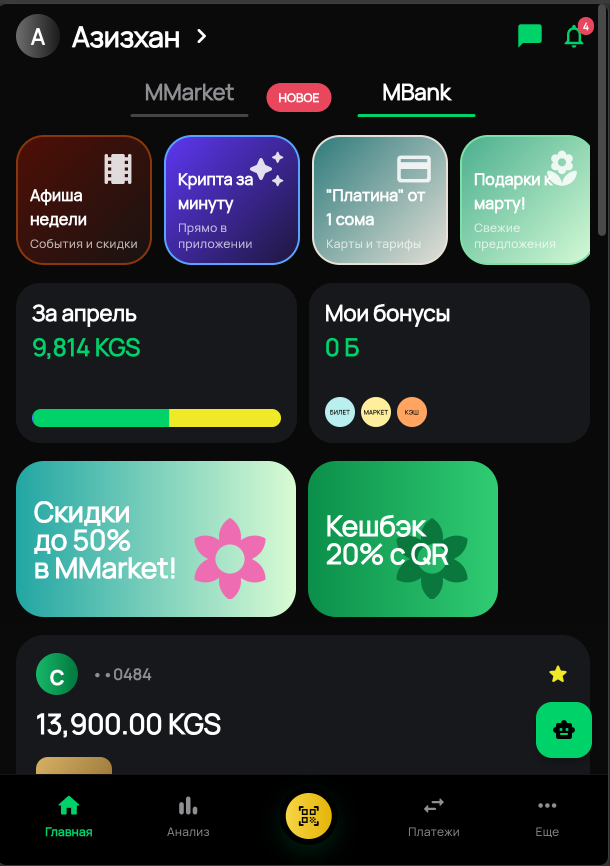
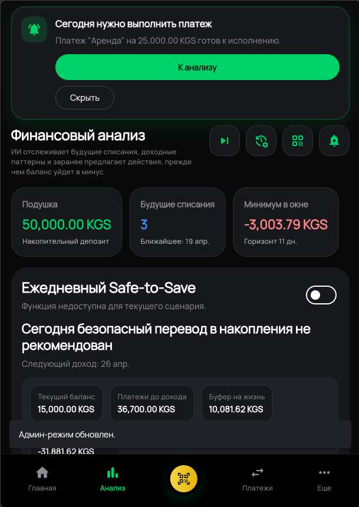
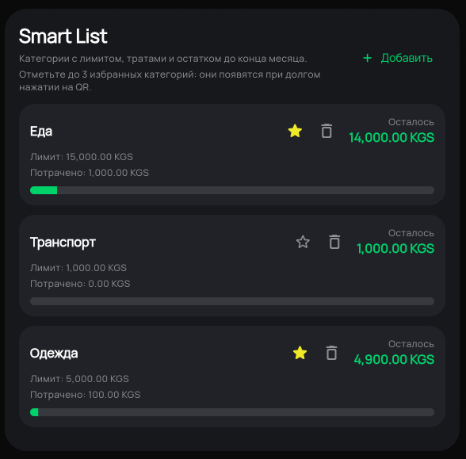
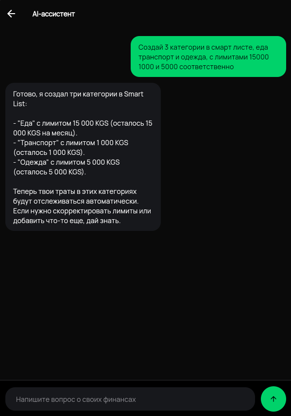

# HackathonBank

Демо-банк на `Spring Boot + Flutter` с фокусом на персональную финансовую аналитику, Smart List лимиты, прогноз баланса и AI-assisted сценарии.

## Что это за проект

HackathonBank моделирует банковское приложение с тремя основными слоями:

- `Backend` на Spring Boot управляет счетами, транзакциями, переводами, отложенными платежами, Smart List категориями и AI-сервисами.
- `Frontend` на Flutter показывает мобильный UI в стиле MBank: главная, анализ, платежи, уведомления и AI-чат.
- `AI layer` помогает анализировать cash flow, рассчитывать `Safe-to-Save`, предлагать действия до кассового разрыва и отвечать на вопросы о личных финансах.

Проект работает как локальный demo sandbox: при запуске поднимается in-memory база H2 и загружаются сиды с тестовыми финансовыми данными.

## UI Preview

<table>
  <tr>
    <td></td>
    <td></td>
  </tr>
  <tr>
    <td></td>
    <td></td>
  </tr>
  <tr>
    <td align="center"><sub>Главная с банковыми карточками и быстрым обзором месяца</sub></td>
    <td align="center"><sub>Финансовый анализ: Safe-to-Save, будущие списания, риск кассового разрыва</sub></td>
  </tr>
  <tr>
    <td align="center"><sub>Smart List с лимитами, остатком и состоянием категорий</sub></td>
    <td align="center"><sub>AI-чат для советов по бюджету и действий со Smart List</sub></td>
  </tr>
</table>

## Ключевые возможности

- Счета и карты с основным и накопительным балансом.
- История транзакций, пополнений и списаний за последние 3 месяца.
- Переводы и платежи с выбором Smart List категории.
- Smart List категории с лимитами, остатком бюджета и привязкой трат.
- Будущие списания и отложенные платежи для моделирования cash gap.
- Экран анализа с прогнозом баланса, monthly breakdown и действиями до ухода в минус.
- `Safe-to-Save` логика для оценки безопасного перевода в накопления.
- AI-чат и AI-рекомендации на базе актуального финансового контекста пользователя.
- Уведомления по операциям и системным событиям.

## Технологический стек

| Layer | Stack |
| --- | --- |
| Backend | Java 17, Spring Boot 3.5.7, Spring Web, Spring Data JPA, Spring Security, Spring AI |
| Data | H2 (in-memory), Flyway migrations |
| Frontend | Flutter, Dart, local package `m_bank_dashboard` |
| UI libs | `fl_chart`, `google_fonts`, `intl`, `http` |
| AI provider | OpenAI-compatible API через Spring AI, по умолчанию xAI/Grok runtime |

## Основные пользовательские сценарии

### 1. Ежедневный banking flow

- посмотреть счета, остатки и последние операции;
- отправить перевод или оплатить расход;
- открыть уведомления и обработать непривязанные траты;
- распределить расходы по Smart List.

### 2. Анализ денежных потоков

- увидеть будущие обязательные списания;
- проверить минимальный прогнозный баланс в окне;
- открыть рекомендации по закрытию кассового разрыва;
- оценить, можно ли безопасно отложить часть суммы в накопления.

### 3. Работа с AI

- спросить, как сократить расходы или накопить на цель;
- получить advice на основе балансов, транзакций, scheduled payments и Smart List;
- создать или изменить Smart List категорию через AI-инструменты;
- подтвердить destructive action, если ИИ предлагает удалить категорию.

## Архитектура

### Backend

Основные модули:

- `src/main/java/com/example/hackathonbank/controller`  
  REST endpoints для счетов, транзакций, переводов, Smart List, scheduled payments, AI и demo-flow.
- `src/main/java/com/example/hackathonbank/service`  
  Бизнес-логика счетов, transfers, forecasting, daily savings, AI chat/context и recurring obligations.
- `src/main/java/com/example/hackathonbank/ai`  
  AI-анализ, tool-calling и обогащение транзакций.
- `src/main/java/com/example/hackathonbank/model`  
  JPA-модели: `Account`, `Transaction`, `ScheduledPayment`, `SmartCategory`, `ChatMessage`, `UserSettings`.

### Frontend

Основные модули:

- `mobile/lib/screens`  
  App shell, home, analysis, transfers, notifications, AI chat.
- `mobile/lib/services`  
  HTTP client и repository-слой для backend API.
- `mobile/lib/models`  
  Модели UI и API DTO.
- `mobile/packages/m_bank_dashboard`  
  Переиспользуемый dashboard package с анализом, графиками и Smart List виджетами.

## Локальный запуск

### Требования

- Java 17+
- Flutter SDK
- Windows shell scripts из `scripts/`
- AI key в `.env.local` или в переменных окружения

### Быстрый старт

Из корня проекта:

```bat
cmd.exe /c scripts\start-backend.cmd
cmd.exe /c scripts\start-frontend.cmd
```

Остановить оба процесса:

```bat
cmd.exe /c scripts\stop-project.cmd
```

После запуска:

- frontend: [http://localhost:3000](http://localhost:3000)
- backend: [http://localhost:8080/api/v1/accounts](http://localhost:8080/api/v1/accounts)

### Ручной запуск backend

```bat
.\mvnw.cmd spring-boot:run
```

### Ручной запуск Flutter app

```bat
cd mobile
cmd.exe /c flutter pub get
cmd.exe /c flutter run -d web-server --web-port 3000
```

## AI configuration

Проект читает конфигурацию AI из `src/main/resources/application.properties` и `.env.local`.

Поддерживаемые переменные:

```properties
XAI_API_KEY=...
AI_API_KEY=...
AI_API_URL=https://api.x.ai/v1/chat/completions
AI_BASE_URL=https://api.x.ai
AI_MODEL=grok-4-fast-non-reasoning
APP_AI_REQUEST_TIMEOUT_SECONDS=40
```

Если ключ не задан, live AI-пути не будут работать корректно.

## Тестирование

### Backend

```bat
.\mvnw.cmd test
```

### Flutter app

```bat
cd mobile
cmd.exe /c flutter analyze
cmd.exe /c flutter test --machine
```

### Dashboard package

```bat
cd mobile\packages\m_bank_dashboard
cmd.exe /c flutter analyze
cmd.exe /c flutter test --machine
```

## Важные особенности demo-режима

- База данных `H2` поднимается в памяти и сбрасывается на каждом старте.
- Demo данные пересоздаются из `DataSeederConfig`.
- Security для локального сценария максимально упрощена.
- Основная локаль интерфейса — русский язык, валюта — `KGS`.

## Полезные документы

- [CURRENT_FINANCIAL_ALGORITHMS.md](CURRENT_FINANCIAL_ALGORITHMS.md) — полный обзор текущих финансовых алгоритмов.
- [SAFE_TO_SAVE_ALGORITHM.md](SAFE_TO_SAVE_ALGORITHM.md) — подробное описание `Safe-to-Save` и его решений.

## License

[MIT](LICENSE)
